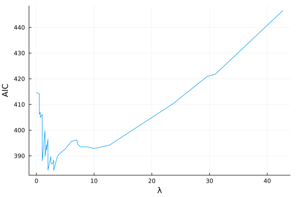
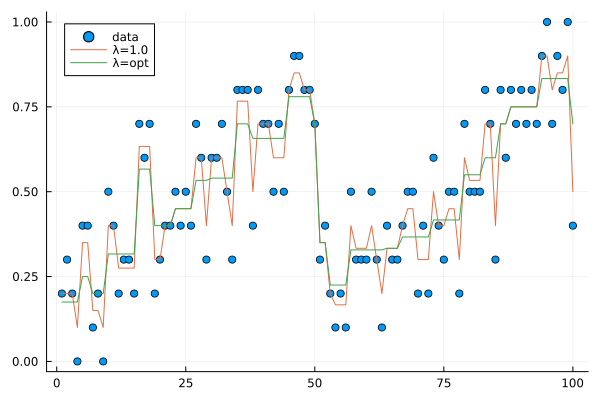

# Examples

## Standard isotonic regression

```
julia> using IsoFuns

julia> n = 5
5

julia> x = (1:n)/n + randn(n)
5-element Vector{Float64}:
 0.7382449115188521
 0.0017480727195733348
 1.8535356206530813
 0.440015631618591
 1.1163182317933293

julia> y = iso(x)
5-element Vector{Float64}:
 0.3699964921192127
 0.3699964921192127
 1.1366231613550006
 1.1366231613550006
 1.1366231613550006
```

## Generalized nearly isotonic regression (binomial)

```
using Plots
using Distributions
```

```
N = 10
n = 100
p = zeros(n)
p[1:50] = range(0.2,0.8,length=50)
p[51:100] = range(0.2,0.8,length=50)
trial = N*ones(n)
success = zeros(n)
for i=1:n
    success[i] = rand(Binomial(N,p[i]))
end
x = success./trial
```

```
y = neariso_Binomial(success,1.0,trial)[1];
```

```
plot(x,st=:scatter,label="data")
plot!(y,label="λ=1.0")
```


```
aic_λ,aic_value=IsoFuns.neariso_AIC_Binomial(success,trial)
plot(aic_λ,aic_value,xlabel="λ",ylabel="AIC")
```



```
λ_opt = aic_λ[argmin(aic_value)]
z = neariso_Binomial(success,λ_opt,trial)[1]
```

```
plot(x,st=:scatter,label="data")
plot!(y,label="λ=1.0")
plot!(z,label="λ=opt")
```

